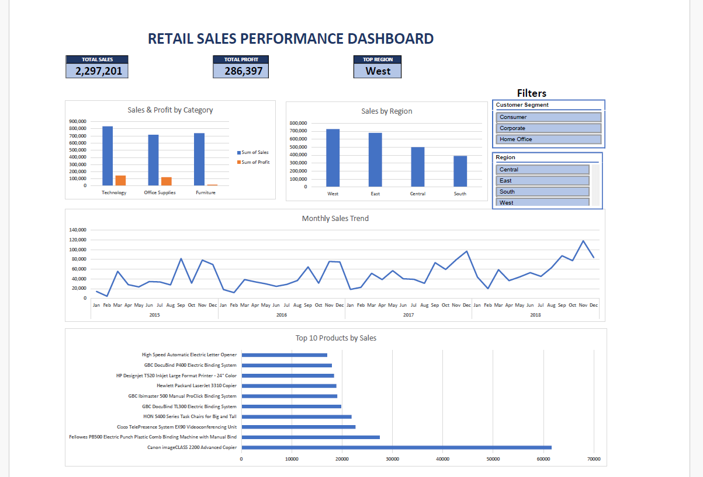
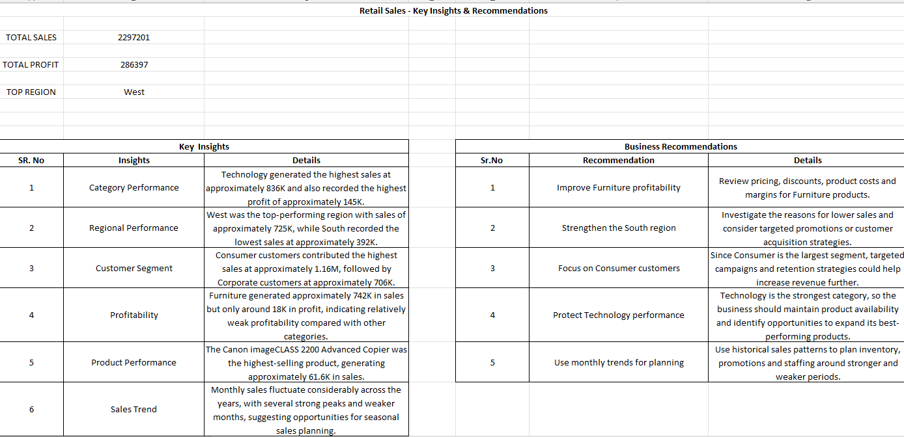

# Retail Sales Performance Dashboard – Excel

## Project Overview

This project analyzes retail sales data to evaluate sales performance, profitability, regional performance, customer segments, product performance, and monthly sales trends.

An interactive Excel dashboard was created to help users explore the data and identify important business trends and opportunities.

## Business Questions

- What are the overall sales and profit levels?
- Which product category performs the best?
- Which region generates the highest sales?
- Which customer segment contributes the most sales?
- Which products are the top sellers?
- How do sales vary across months and years?
- Which areas require business attention?

## Tools Used

- Microsoft Excel
- PivotTables
- PivotCharts
- Excel formulas
- Slicers
- Data analysis
- Data visualization

## Data Preparation

The Orders dataset was reviewed for basic data quality issues including:

- Missing values
- Duplicate records
- Data consistency
- Relevant data quality checks

The raw Orders data was retained as the source dataset, while analysis was performed using PivotTables and supporting calculations.

## Dashboard Features

- Total Sales KPI
- Total Profit KPI
- Top Region KPI
- Sales & Profit by Category
- Sales by Region
- Monthly Sales Trend
- Top 10 Products by Sales
- Customer Segment slicer
- Region slicer
- Interactive KPI and chart updates

## Key Insights

- Technology generated the highest sales and profit among the product categories.
- West was the highest-performing region by sales.
- Consumer customers contributed the largest share of sales.
- Furniture generated substantial sales but comparatively low profit, indicating a profitability concern.
- Canon imageCLASS 2200 Advanced Copier was the highest-selling product in the Top 10 analysis.
- Monthly sales fluctuated considerably across the years, with several stronger and weaker periods.

## Business Recommendations

- Review pricing, discounts, product costs, and margins for Furniture products.
- Investigate the lower sales performance of the South region.
- Focus on Consumer customers through targeted campaigns and retention strategies.
- Maintain product availability and expand opportunities around strong-performing Technology products.
- Use historical monthly sales patterns for inventory, promotions, and staffing planning.

## Project Workflow

Raw Data  
↓  
Data Quality Checks  
↓  
PivotTable Analysis  
↓  
KPI Analysis  
↓  
Interactive Dashboard  
↓  
Business Insights  
↓  
Recommendations

## Dashboard Preview

## KPI Analysis

